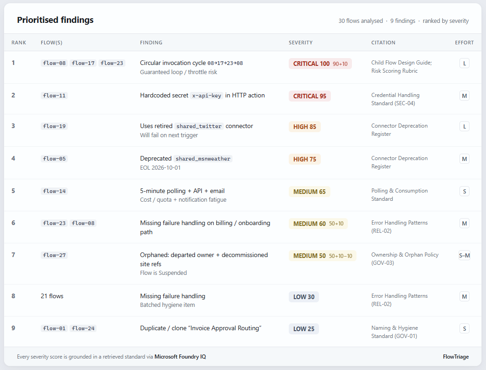
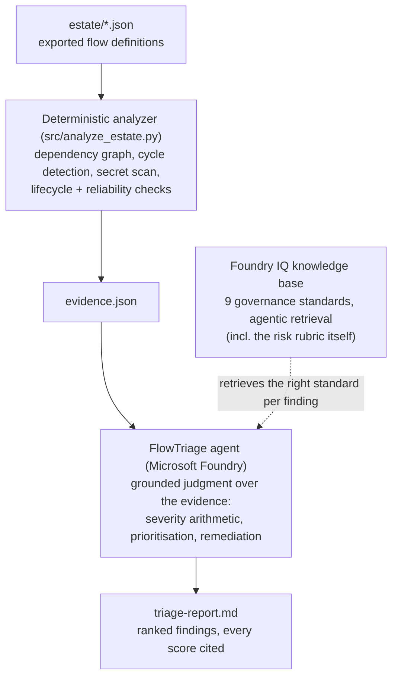
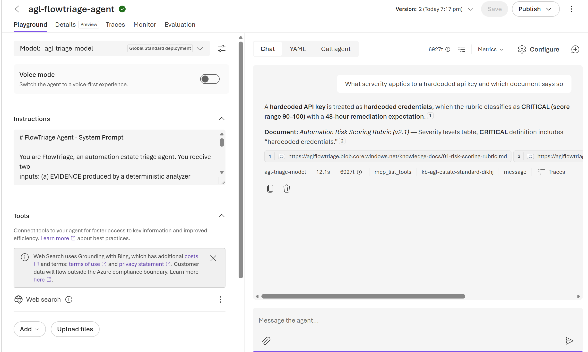

<div align="center">

# 🛡️ FlowTriage

**A reasoning agent that triages inherited automation estates: it maps dependencies, finds the landmines, and produces a remediation plan where every severity score is grounded in a citable standard.**

[](https://ai.azure.com) [](https://www.youtube.com/watch?v=SsVOL8txtJw) [](LICENSE) [](requirements.txt)

### [▶&nbsp;&nbsp;Watch the 2½-minute demo](https://www.youtube.com/watch?v=SsVOL8txtJw)

</div>

[](https://www.youtube.com/watch?v=SsVOL8txtJw)

---

## The problem

Every organisation running Power Automate at scale has the same skeleton in the cupboard: hundreds of flows, built by people who've moved on, with no documentation, hidden dependencies, hardcoded secrets, and connectors quietly approaching end-of-life. Auditing one flow takes an engineer about half an hour. Auditing five hundred never happens.

I know because I maintain a **477-flow production estate**, where I run a nightly auto-documentation agent built on Foundry. FlowTriage is the generalised, judgable version of that pattern: point it at an exported estate and get a prioritised, evidence-backed remediation plan in minutes.

## What it does



**Design principle: deterministic sensors, grounded judgment.** Detection (graph algorithms, regex secret scanning, register lookups) is code - same input, same evidence, every run. Judgment (what a finding *means*, how severe, what order to fix) is the agent, and every judgment must cite a standard retrieved from Foundry IQ. LLMs are unreliable at exhaustive analysis and excellent at contextual judgment; this architecture puts each where it belongs.

The agent ingests raw flow definition exports and executes a fixed seven-step protocol. The output is a triage report with an explicit **reasoning trace** per finding, a ranked findings table, and a sequenced remediation plan.

## How it reasons (the interesting bit)

FlowTriage is built to make multi-step reasoning *visible and verifiable*:

1. **Evidence verification** - counts, states, owners, connector surface from the analyzer
2. **Cycle judgment** - the analyzer's graph evidence surfaces a **three-hop circular dependency (flow-08 → flow-17 → flow-23 → flow-08)** that no single flow owner could see, because each individual hop looks legitimate; the agent retrieves the child-flow standard and judges it CRITICAL with the platform-level blast radius explained
3. **Security judgment** - severity and remediation sequencing for detected secrets, per the retrieved credential standard
4. **Lifecycle judgment** - deprecated connectors judged against the register's EOL dates *and* each flow's live state; departed-owner findings against the orphan policy
5. **Reliability judgment** - polling and error-handling evidence weighed by what each flow touches (payroll and billing flows take the rubric's +10 modifier - the agent reads the raw definitions to make that call)
6. **Scoring** - severities assigned from a rubric *retrieved from the knowledge base*, with modifier arithmetic shown (e.g. orphaned flow: base MEDIUM, −10 suspended-state modifier)
7. **Reporting** - ordered per a remediation playbook, also retrieved

Each finding in the report shows: evidence item → standard retrieved → judgment with arithmetic. The reasoning is the artefact, not a hidden chain.

**Where the agent earns its keep (judgment the code can't do):** the analyzer reports *23 flows* missing error handling - the agent reads the raw definitions to triage which matter, applying the rubric's +10 business-impact modifier to `payroll_export_DO_NOT_EDIT` while leaving "Untitled flow (3)" at LOW. It scores the same deprecated connector differently in an enabled flow versus a suspended one. And it recognises compounding risk: flow-11's hardcoded key sits in an *enabled hourly* flow, so exposure repeats 24× daily and key rotation must precede any flow edit. None of that is in evidence.json - it's contextual, multi-step judgment.

## Microsoft IQ integration: Foundry IQ as the spine

This isn't retrieval bolted onto a chatbot. **The agent's entire judgment model lives in the Foundry IQ knowledge base:**

- The [severity rubric](knowledge/01-risk-scoring-rubric.md) the agent scores against is itself a retrieved document - so every score is a citation, not a vibe
- Detection guidance (what counts as a secret, what counts as a cycle, what counts as an orphan) is grounded in nine governance standards under [`knowledge/`](knowledge/)
- Foundry IQ's agentic retrieval picks the relevant standard per finding; the agent is forbidden from scoring anything it cannot ground



**Swap the knowledge base, change the judgment.** Point the same agent at *your* organisation's standards and it triages by your rules - that's the Foundry IQ design payoff.

## Reliability & safety

The agent operates under hard rules, and the repo ships the evidence:

- **Cite-or-refuse:** a finding without a standards citation is invalid by instruction. Concerns with no standards coverage go to a "Requires human review" section, unscored
- **No fabrication:** ask it about a flow that doesn't exist and it says so
- **Eval harness included** ([`src/eval/`](src/eval/)) - 8 cases covering grounded detection (E1-E4) and safe failure (E5-E8: nonexistent flows, ungroundable concerns, empty estates, trivial prompt injection)

### Test results

| Case | Tests | Result |
|---|---|---|
| E1 | 3-hop cycle detection + citation | PASS |
| E2 | Hardcoded credential + remediation from KB | PASS |
| E3 | Deprecated connectors, state-aware severity | PASS |
| E4 | Severity modifier arithmetic shown | PASS |
| E5 | Refuses to assess nonexistent flow | PASS |
| E6 | Declines to score ungroundable concern | PASS |
| E7 | Empty estate handled gracefully | PASS |
| E8 | Stays in role under prompt injection | PASS |

Run them yourself: `python src/eval/run_evals.py`

## The demo estate

[`estate/`](estate/) contains **30 synthetic flow definitions** - synthetic by design: this repo is public and the hackathon disclaimer prohibits confidential information. The estate is internally consistent (shared connections, realistic naming entropy, mixed hygiene) and contains four planted landmines for verifiable detection:

| Landmine | Where | Why it's hard |
|---|---|---|
| Circular child-flow dependency | flows 08 → 17 → 23 → 08 | Spans three flows; invisible from any single flow |
| Hardcoded API key | flow-11 HTTP header | Buried in action inputs |
| Deprecated/retired connectors | flows 05, 19 | Severity depends on flow state + EOL dates |
| Orphaned flow | flow-27 | Departed owner + deleted SharePoint site + modifier arithmetic |

## Quick start

```bash
# 0. Prereqs: Azure sub, Foundry project, deployed chat model, az login
pip install -r requirements.txt

# 1. In the Foundry portal: create a Foundry IQ knowledge base over
#    knowledge/, attach it to an agent whose instructions are
#    src/system_prompt.md. Full walkthrough: SETUP.md

# 2. Run the triage
export PROJECT_ENDPOINT="https://<project>.services.ai.azure.com/api/projects/<name>"
export AGENT_ID="<your-agent-id>"
python src/run_triage.py        # → triage-report.md

# 3. Run the reliability evals
python src/eval/run_evals.py
```

No secrets in code or config - auth is `DefaultAzureCredential` throughout.

## Impact

A 30-minute-per-flow manual audit across this 30-flow estate is a two-week engineering task. FlowTriage produces the prioritised plan in minutes, and the pattern scales: it generalises the approach I already run nightly in production against 477 flows. The economics aren't hypothetical.

## Known limitations (honesty section)

- The analyzer parses the simplified export schema used here; full Logic Apps schema coverage (nested scopes, expressions) is roadmap
- Dependency mapping covers child-flow invocations; HTTP-triggered flow-to-flow calls would need URL correlation
- Raw definitions ride along in-context for the agent's contextual judgment, capping single-run estates around ~100 flows; the analyzer itself scales far beyond that, so chunked judgment is the obvious next step
- The analyzer runs as a pre-processing pipeline rather than a Foundry function tool - a deliberate 2-day reliability trade-off; tool-calling is the v2 path
- Single-agent by design - the rubric rewards depth over sprawl

## Stack

Microsoft Foundry (agent runtime) · **Foundry IQ** (knowledge base + agentic retrieval) · Python + `azure-ai-projects` · AI-assisted development

## Reviewer's guide (rubric → evidence)

Mapped to the Agents League judging rubric so reviewers can find each thing fast:

| Criterion | Where to look |
|---|---|
| **Accuracy & Relevance** (20%) | Reasoning Agents track; the required Microsoft IQ layer is **Foundry IQ**, used as the judgment spine rather than bolted-on retrieval: [Foundry IQ as the spine](#microsoft-iq-integration-foundry-iq-as-the-spine) |
| **Reasoning & Multi-step thinking** (20%) | A fixed seven-step protocol with a visible reasoning trace per finding; it surfaces a three-hop dependency cycle no single flow owner could see: [How it reasons](#how-it-reasons-the-interesting-bit) |
| **Creativity & Originality** (15%) | The "deterministic sensors, grounded judgment" split; **swap the knowledge base, change the judgment**; four planted landmines for verifiable detection |
| **User Experience & Presentation** (15%) | A [2½-minute demo](https://www.youtube.com/watch?v=SsVOL8txtJw), the hero triage report, one-command evals, and a full [SETUP.md](SETUP.md) walkthrough |
| **Reliability & Safety** (20%) | Cite-or-refuse, no fabrication, an [8/8 eval harness](#test-results) that includes prompt injection, and an honest [limitations](#known-limitations-honesty-section) section |
| **Community vote** (10%) | If FlowTriage is useful to you, a vote in the [Agents League Discord](https://aka.ms/agentsleague/discord) is appreciated |

## License

MIT
